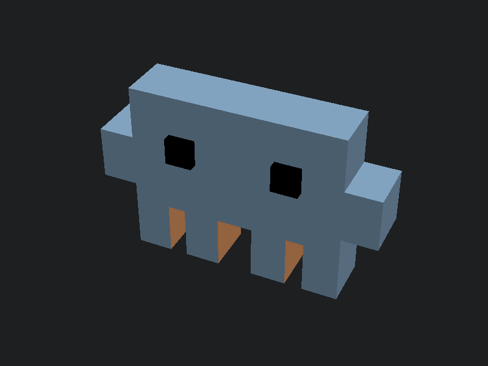

# Sketch2Print

An agent-assisted workflow for turning reference images into 3D-printable OpenSCAD models and export-ready print files.

## Features

- **Agent-guided modeling**: Analyze reference images and generate OpenSCAD code with an iterative agent workflow
- **Visual iteration**: Compare renders with the original reference and refine the model step by step
- **Version tracking**: Automatic versioning of design iterations (001, 002, ...)
- **Printable output**: Export to 3MF (default) or STL with geometry validation
- **BOSL2 included**: Full BOSL2 library available for advanced modeling

## Requirements

- [Claude Code](https://claude.ai/claude-code)
- [OpenSCAD](https://openscad.org/) (installed and accessible)

## Quick Start

1. Place a reference image in `references/`:
   ```
   cp my_sketch.png references/
   ```

2. Use the skills in Claude Code:
   ```
   /pic2scad references/my_sketch.png
   ```

3. Iterate until the render matches your reference:
   ```
   /iterate
   ```

4. Export the final model:
   ```
   /export-print
   ```

## Workflow

```
Reference Image → /pic2scad → /iterate (repeat) → /export-print
                      ↓              ↓                    ↓
                 Agent-built    Agent-refined        Printable
                   .scad           model             3MF/STL
```

## Gallery

### clawd

Latest iteration: [`iterations/clawd/clawd_004.scad`](iterations/clawd/clawd_004.scad)

| Reference | Latest Render |
|-----------|---------------|
|  |  |

## Skills

| Skill | Description |
|-------|-------------|
| `/pic2scad` | Analyze reference image, generate first OpenSCAD version, render preview |
| `/iterate` | Use a subagent with a custom prompt to compare render vs reference, then create an improved version |
| `/export-print` | Export to 3MF/STL with geometry validation |

## File Layout

Reference images stay in `references/`.
All generated iteration files stay in `iterations/<project_name>/`.

## Project Structure

```
Sketch2Print/
├── CLAUDE.md                    # Agent instructions
├── references/                  # Reference images (input)
├── iterations/                  # Per-project iteration outputs
├── libs/BOSL2/                  # BOSL2 library (submodule)
├── iterations/<project>/        # Project-specific output directory
│   ├── <project>_NNN.scad       # Generated OpenSCAD files
│   ├── <project>_NNN.png        # Render previews
│   ├── <project>_NNN.3mf        # Printable export
│   └── <project>_NNN.stl        # Optional STL export
└── .claude/skills/
    ├── pic2scad/                # Image analysis + SCAD generation
    ├── iterate/                 # Subagent-guided visual comparison + improvement
    ├── export-print/            # Export + validation
    └── resources/               # OpenSCAD cheatsheet, BOSL2 ref, print guidelines
```

## References

- Inspired in part by [openscad-agent](https://github.com/iancanderson/openscad-agent)

## License

MIT
